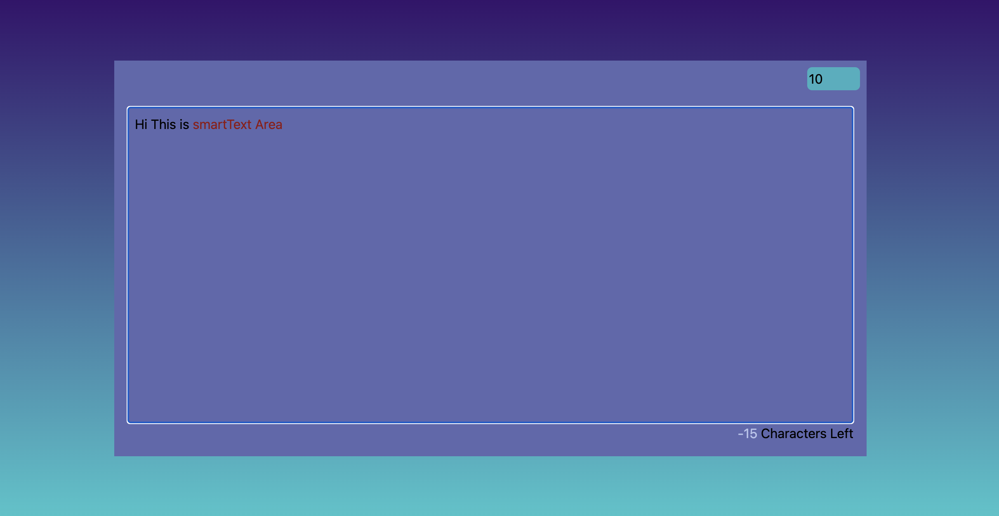

# Smart Text Area App

## Overview

Smart Text Area App is a React-based web application designed to handle text input with a dynamic character count limit. Users can interactively adjust the maximum number of characters allowed, and the app provides visual feedback when the limit is exceeded.

## Features

* **Dynamic Character Limit:** Users can set and adjust the maximum number of characters allowed for the text input.
* **Interactive Input Field:** Text area allows for real-time text editing.
* **Visual Feedback:** When the character limit is exceeded, the excess text is highlighted in red.
* **Focus Management:** Automatically focuses the input field when the character limit is cleared.

## Installation

1. Clone the repository:
   <pre>git clone https://github.com/jkjitendra/React_Projects.git</pre>
2. Navigate to the project directory:
   <pre>cd smart-textarea</pre>
3. Install the necessary dependencies:
   <pre>npm install</pre>
4. Start the application:
   <pre>npm start</pre>Access the application at http://localhost:5173

## Usage

1. Enter text into the editable area to see the character count update in real-time.
2. Adjust the maximum character count using the numeric input field at the top-right corner of the application window.
3. The excess characters are highlighted in red if the entered text surpasses the set limit.
4. To reset or change the character limit, simply modify the value in the numeric input field.

## Technologies Used

* React.js + Vite
* Tailwind CSS for styling

## Scripts

* `npm run dev`: Launches the application in development mode.
* `npm run build`: Builds the app for production to the `build` folder.
* `npm test`: Launches the test runner in the interactive watch mode.

## Interface Preview

Here is a preview of the Smart Text Area App in use:

## Code Explanation

The `App.jsx` file contains the main React component that manages the state for the text input and character limit. It includes handlers for input changes and effects for updating the DOM in response to state changes.

## Contact

For more information or support, please contact [your_email@example.com](https://chat.openai.com/c/496f6d6a-86ad-4646-9afd-1110d35f2265).
