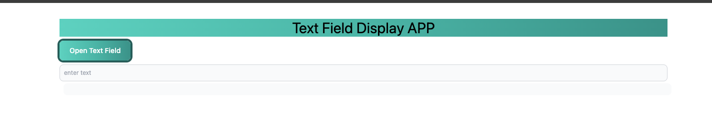

# Text Field Display App

## Overview

Text Field Display App is a simple React application that consists of two components: TextBoxContainer and DisplayBoxContainer. The app allows users to enter text into a text box, and the entered text is displayed in a separate container.

## Features

* **Text Input:** Users can enter text into the text box.
* **Display Box:** The entered text is displayed in a separate container.
* **Toggle Visibility:** Users can toggle the visibility of the text box and display box.

## Demo

You can see a live demo of the Text Field Display App [here]().

## Installation

1. Clone the repository:

   <pre>git clone https://github.com/jkjitendra/React_Projects.git
   </pre>
2. Install dependencies:

   <pre>cd textfielddisplayapp
   npm install
   </pre>
3. Run the app:

   <pre>npm run dev
   </pre>

   The app will be accessible at [http://localhost:5173]().

## Usage

1. Click the "Open Text Field" button to toggle the visibility of the text box.
2. Enter text into the text box.
3. The entered text will be displayed in the display box below.

## Components

### 1. App Component (`App.jsx`)

The main component that manages the state and renders the TextBoxContainer and DisplayBoxContainer components. It also provides a button to toggle the visibility of the text box.

### 2. DisplayBoxContainer Component (`DisplayBoxContainer.jsx`)

A functional component that receives the entered text as a prop and displays it in a styled container.

### 3. TextBoxContainer Component (`TextBoxContainer.jsx`)

A functional component that contains an input field for entering text. It updates the state and communicates the entered text to the parent component.

## Technologies Used

* React.js
* Vite
* Tailwind CSS

## Scripts

* `npm run dev`: Start the development server.
* `npm run build`: Build the production-ready app.
* `npm run lint`: Run ESLint for code linting.
* `npm run preview`: Preview the production build.

## Interface Preview:

Below is a screenshot of the Text Field Display App in action:

## Contact

For inquiries or support, please contact Jitendra Tiwari at [jitendakumartiwari849@gmail.com]().
